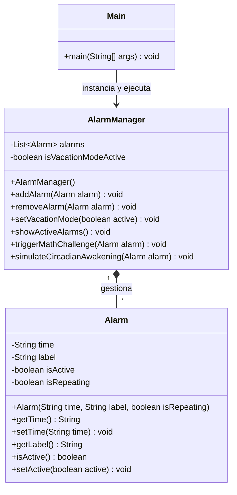

## 6. Diseño orientado a objetos (Diagrama UML)

A continuación se muestra el diagrama de clases del sistema. Se ha optado por una arquitectura modular aplicando el principio de Responsabilidad Única (SRP), separando la entidad pura (`Alarm`) del gestor de la lógica de negocio (`AlarmManager`).

## 9. Especificación de Casos de Uso

### Caso de Uso 1: Crear una nueva alarma
* **Nombre:** Crear Alarma
* **Actor principal:** Usuario
* **Precondiciones:** El sistema de alarmas debe estar iniciado y ejecutándose.
* **Flujo principal:**
  1. El usuario solicita crear una nueva alarma.
  2. El usuario introduce la hora, la etiqueta y si es recurrente.
  3. El sistema valida los datos introducidos.
  4. El sistema (`AlarmManager`) registra la nueva alarma en la lista y la activa por defecto.
  5. El sistema confirma la creación mostrando un mensaje por consola.
* **Postcondiciones:** La alarma queda guardada en el gestor, activada y lista para sonar a su hora correspondiente.
* **Excepciones:** Si el usuario introduce un formato de hora inválido o vacío, el sistema avisa del error y no crea la alarma.

### Caso de Uso 2: Apagar alarma con Reto Matemático
* **Nombre:** Desactivar Alarma (Reto Matemático)
* **Actor principal:** Usuario
* **Precondiciones:** Una alarma debe haber alcanzado su hora de activación y estar sonando. El modo vacaciones debe estar desactivado.
* **Flujo principal:**
  1. El sistema detecta que es la hora y activa el evento de sonido.
  2. El sistema genera una suma matemática aleatoria (ej. 15 + 23) y la muestra por consola.
  3. El usuario lee la operación y teclea el resultado.
  4. El sistema comprueba si el resultado coincide con el cálculo correcto.
  5. El sistema desactiva el sonido y pasa la alarma a estado inactivo.
* **Postcondiciones:** La alarma deja de sonar y el usuario se ha despertado.
* **Excepciones:** Si el usuario introduce un resultado numérico incorrecto o letras, el sistema indica error, la alarma sigue sonando y vuelve a pedir que se resuelva la operación.
## 10. Uso de Inteligencia Artificial y Reflexión Crítica

Durante el desarrollo de esta práctica, se ha utilizado la IA generativa (Gemini) como asistente de programación y estructuración del proyecto.

**1. Herramientas utilizadas y propósito:**
Se utilizó Gemini para generar la estructura inicial de las clases orientadas a objetos, obtener los comandos exactos del flujo de trabajo de Git/GitHub, y generar el código en formato Mermaid para el diagrama UML.

**2. Prompts utilizados (Ejemplos):**
* *"Aquí te dejo una práctica de entornos, quiero que me ayudes a hacerla paso a paso, explicando todo."* (Para definir la arquitectura inicial).
* *"Dime cómo crearlo y el rollo, todos los pasos."* (Para obtener los comandos de clonación y creación de ramas en Git).

**3. Código generado y modificaciones:**
La IA generó el esqueleto principal de `Alarm.java` y `AlarmManager.java`, además de la lógica algorítmica para las funcionalidades avanzadas (Reto Matemático y Despertar Circadiano).
*Modificaciones:* Se tuvo que intervenir manualmente en la configuración del entorno de Eclipse, ya que el código base sugerido entraba en conflicto con el sistema de módulos de Java (`module-info.java`), lo cual se solucionó desactivando dicha opción al crear el proyecto.

**4. Reflexión crítica:**
* **Ventajas:** Acelera drásticamente la configuración inicial del entorno y proporciona una sintaxis limpia para los métodos base. Ayuda a no olvidar pasos del flujo de Git.
* **Limitaciones y Riesgos:** La IA no siempre conoce el estado exacto del entorno de desarrollo local. Generó soluciones que asumían que el proyecto de Eclipse ya estaba configurado como "Java Project", lo que causó bloqueos iniciales al intentar crear las clases.
* **Validación:** Todo el código generado se validó mediante pruebas de ejecución directa en la consola de Eclipse (ver capturas en `/docs`), comprobando que la lógica cumplía estrictamente con los requisitos sin usar interfaces gráficas.